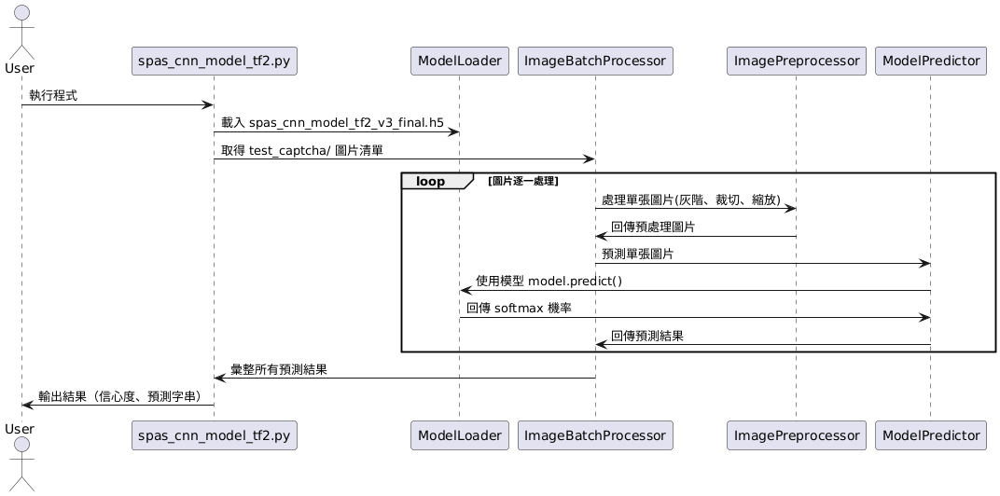

# CAPTCHA CNN 辨識系統

本專案為一套基於 TensorFlow/Keras 的驗證碼（CAPTCHA）自動辨識系統，包含訓練與預測兩大模組，並支援批次處理。
本 README 依據原始碼與訓練紀錄檔案，說明專案架構、訓練流程、模型效能與使用方式。

---

## 目錄

- [專案結構](#專案結構)
- [功能說明](#功能說明)
- [訓練流程與模型效能分析](#訓練流程與模型效能分析)
- [預測流程](#預測流程)
- [如何使用](#如何使用)
- [依賴套件](#依賴套件)
- [常見問題](#常見問題)

---

## 專案結構

```
captcha/
├── spas_train_tf2.py                # 模型訓練主程式
├── spas_cnn_model_tf2.py            # 模型預測主程式
├── train_data/                      # 訓練過程紀錄 (json)
│   ├── Run_Time_2025_05_02_15_53_10_train.json           # 訓練準確率
│   ├── Run_Time_2025_05_02_15_53_10_train_loss.json      # 訓練損失
│   ├── Run_Time_2025_05_02_15_53_10_train_lr.json        # 學習率
│   ├── Run_Time_2025_05_02_15_53_10_validation.json      # 驗證準確率
│   └── Run_Time_2025_05_02_15_53_10_validation_loss.json # 驗證損失
├── label_captcha_tool-master/
│   ├── captcha/                     # 訓練用原始驗證碼圖片
│   └── label.csv                    # 驗證碼標籤
├── test_captcha/                    # 測試/預測用圖片
├── logs/                            # TensorBoard 紀錄檔
├── spas_cnn_model_tf2_v3.h5         # 訓練中儲存的模型 (可能被覆蓋)
├── best_model_weights.h5            # 驗證準確率最佳的模型權重
└── spas_cnn_model_tf2_v3_final.h5   # 最終用於預測的模型 (來自 best_model)
```

---

## 功能說明

- **spas_train_tf2.py**
  - 讀取 `label_captcha_tool-master/captcha` 中的圖片與 `label.csv` 中的標籤。
  - 對圖片進行預處理（灰階、分割字元、正規化）。
  - 將標籤轉換為 One-Hot 編碼。
  - 分割訓練集與驗證集。
  - 建立或載入 CNN 模型。
  - 使用資料增強、EarlyStopping、ReduceLROnPlateau、ModelCheckpoint 等策略進行訓練。
  - 將訓練過程的指標（Accuracy, Loss, Learning Rate）記錄到 `train_data/` 資料夾。
  - 儲存驗證準確率最高的模型 (`best_model_weights.h5`)，並將其另存為最終模型 (`spas_cnn_model_tf2_v3_final.h5`)。

- **spas_cnn_model_tf2.py**
  - 提供 `processImg` 和 `processBatchImg` 函數對原始驗證碼圖片進行預處理（裁切、灰階、縮放）。
  - 提供 `cnn_model_predict` 函數對單張預處理後的圖片進行預測。
  - 提供 `cnn_model_batch_predict` 函數對 `test_captcha` 資料夾中的所有圖片進行批次預測。
  - 載入 `spas_cnn_model_tf2_v3_final.h5` 模型進行預測。
  - 輸出每個字元的預測信心度（Softmax 輸出）和最終預測的驗證碼字串。

---

## 訓練流程與模型效能分析

### 訓練流程

1.  **資料準備**: 從指定路徑讀取圖片和標籤，使用 `sort_key` 確保順序，`split_digits_in_img` 將每張圖分割成 4 個字元並正規化，`to_onehot` 轉換標籤。
2.  **資料集劃分**: 使用 `train_test_split` 將數據分為 80% 訓練集和 20% 驗證集。
3.  **模型架構**:
    - `Conv2D(32, (3,3), relu)` + `BatchNormalization`
    - `Conv2D(64, (3,3), relu)` + `BatchNormalization`
    - `MaxPooling2D(2,2)`
    - `Dropout(0.3)`
    - `Flatten`
    - `Dense(128, relu)` + `BatchNormalization`
    - `Dropout(0.4)`
    - `Dense(21, softmax)` (對應 `dict_captcha` 中的 20 個字元 + 1 個未知/背景)
    - 使用 L2 正則化 (`weight_decay = 1e-4`)。
4.  **訓練策略**:
    - **優化器**: Adam (初始學習率 0.001)
    - **損失函數**: Categorical Crossentropy
    - **資料增強**: `ImageDataGenerator` (旋轉、平移、縮放、剪切)
    - **回調函數 (Callbacks)**:
        - `TensorBoard`: 記錄訓練過程供視覺化。
        - `EarlyStopping`: 監控 `val_accuracy`，若 5 個 epoch 沒有提升則停止訓練，並恢復最佳權重。
        - `ReduceLROnPlateau`: 監控 `val_accuracy`，若 3 個 epoch 沒有提升則學習率減半。
        - `ModelCheckpoint`: 儲存 `val_accuracy` 最高的模型權重到 `best_model_weights.h5`。
    - **Epochs**: 設定為 50，但可能因 EarlyStopping 提前結束。

### 訓練紀錄分析 (基於 Run_Time_2025_05_02_15_53_10)

- **訓練週期**: 共執行 27 個 Epochs (0-26)。
- **準確率 (Accuracy)**:
    - **訓練集**: 從 ~31.9% 提升至 ~94.4%。
    - **驗證集**: 從 ~4.9% 開始，在第 7 個 epoch 達到 ~97.5%，最終穩定在 ~98.6%。
- **損失值 (Loss)**:
    - **訓練集**: 從 ~2.52 下降至 ~0.31。
    - **驗證集**: 從 ~4.14 開始，在第 7 個 epoch 後穩定在 0.16-0.24 之間，最低約 0.167。
- **學習率 (Learning Rate)**:
    - Epoch 0-10: 0.001
    - Epoch 11-17: 0.0005 (第一次降低)
    - Epoch 18-24: 0.00025 (第二次降低)
    - Epoch 25-26: 0.000125 (第三次降低)

#### 學習曲線摘要

| Epoch | Train Acc | Val Acc | Train Loss | Val Loss | Learning Rate |
| :---- | :-------- | :------ | :--------- | :------- | :------------ |
| 0     | 0.319     | 0.049   | 2.516      | 4.140    | 0.001         |
| 7     | 0.870     | 0.975   | 0.547      | 0.233    | 0.001         |
| 11    | 0.903     | 0.981   | 0.463      | 0.205    | 0.0005        |
| 18    | 0.923     | 0.985   | 0.367      | 0.173    | 0.00025       |
| 25    | 0.941     | 0.986   | 0.326      | 0.167    | 0.000125      |
| 26    | 0.944     | 0.986   | 0.314      | 0.173    | 0.000125      |

- **結論**: 模型訓練效果良好，驗證集準確率高且穩定，學習率調整策略有效，無明顯過擬合現象。最佳模型出現在第 25 或 26 個 epoch。

---

## 預測流程

1.  **載入模型**: 載入 `spas_cnn_model_tf2_v3_final.h5`。
2.  **圖片預處理**:
    - 讀取圖片 (`load_img`)。
    - 轉換為 NumPy 陣列 (`img_to_array`)。
    - 檢查尺寸，若不符 `(img_rows, img_cols)` 則使用 `cv2.resize` 調整。
    - 確保為灰階單通道。
3.  **分割字元**: 使用 `split_digits_in_img` 將預處理後的圖片分割成 4 個字元子圖，並正規化。
4.  **模型預測**:
    - 對每個字元子圖進行 `model.predict`。
    - 使用 `np.argmax` 找到最高機率的類別索引。
    - 使用 `reverse_list` 將索引轉換回對應的字元。
5.  **結果輸出**: 打印每個字元的信心度（Softmax 輸出）和預測類別，最後組合輸出預測的驗證碼字串。

---

## UML 溝通圖

下圖（CAPTCHA_CNN.png）為本專案「批次驗證碼預測」流程的 UML 溝通圖，視覺化展示了主要物件間的互動關係：

- **使用者** 觸發 `spas_cnn_model_tf2.py` 執行批次預測。
- 主程式載入已訓練模型，並取得 `test_captcha/` 目錄下所有待預測圖片。
- 每張圖片會經過預處理（灰階、裁切、縮放），再送入模型進行預測。
- 預測結果（每個字元的信心度與最終驗證碼字串）會彙整並輸出給使用者。



此圖有助於理解專案在批次預測時，程式各模組與物件的協作流程。

---

## 如何使用

### 1. 準備環境與資料

- 安裝依賴套件 (見下一節)。
- 將訓練圖片放入 `label_captcha_tool-master/captcha/`。
- 將訓練標籤放入 `label_captcha_tool-master/label.csv` (需與圖片檔名排序對應)。
- 將待預測的圖片放入 `test_captcha/` (批次預測) 或其他指定路徑 (單張預測)。

### 2. 訓練模型

在終端機中執行：

```bash
python spas_train_tf2.py
```

訓練完成後，最佳模型將儲存為 spas_cnn_model_tf2_v3_final.h5。

### 3. 批次預測圖片

修改 spas_cnn_model_tf2.py 的 `if __name__ == '__main__':` 區塊：

```python
if __name__ == '__main__':
    # 確保 processBatchImg() 或其他預處理函數已將圖片放入 test_captcha
    cnn_model_batch_predict()
```

然後在終端機中執行：

```bash
python spas_cnn_model_tf2.py
```

### 4. 單張圖片預測

修改 spas_cnn_model_tf2.py 的 `if __name__ == '__main__':` 區塊：

```python
if __name__ == '__main__':
    img_filename = r'getKaptchaImg/getKaptchaImg1400.jpeg' # 原始圖片路徑
    predict_img = r'test_captcha/processed_captcha.jpg' # 預處理後圖片儲存路徑
    captcha_code(img_filename, predict_img) # 會先調用 processImg 處理圖片
```

然後在終端機中執行：

```bash
python spas_cnn_model_tf2.py
```

---

## 依賴套件

- numpy
- opencv-python
- tensorflow
- scikit-learn

使用 pip 安裝：

```bash
pip install numpy opencv-python tensorflow scikit-learn
```

---

## 常見問題

### Q1: 預測時出現 `Compiled the loaded model, but the compiled metrics have yet to be built` 警告？

**A:** 這是因為載入模型後直接進行預測，沒有執行 `compile`。雖然不影響預測，但程式中已加入 `model.compile(...)` 來消除此警告。

### Q2: 訓練或預測時出現 `Could not identify NUMA node` 訊息？

**A:** 這是 TensorFlow 在 Mac 上使用 GPU 時的資訊訊息，提示不支援 NUMA 架構，不影響功能，可以忽略。

### Q3: 如何更改驗證碼的字元集或長度？

**A:**
- **字元集**: 修改 spas_train_tf2.py 和 spas_cnn_model_tf2.py 中的 `dict_captcha` 字典，並確保訓練標籤與之一致。同時需要調整模型最後 Dense 層的輸出單元數量 (目前是 21)。
- **長度**: 修改 spas_train_tf2.py 和 spas_cnn_model_tf2.py 中的 `digits_in_img` 變數。這會影響圖片分割和預測循環次數。

---

## 聯絡與貢獻

如有問題或建議，歡迎提出 Issue 或 Pull Request。
`````
